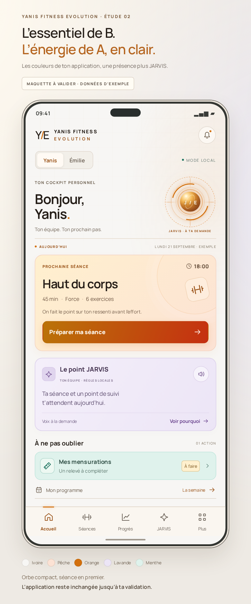
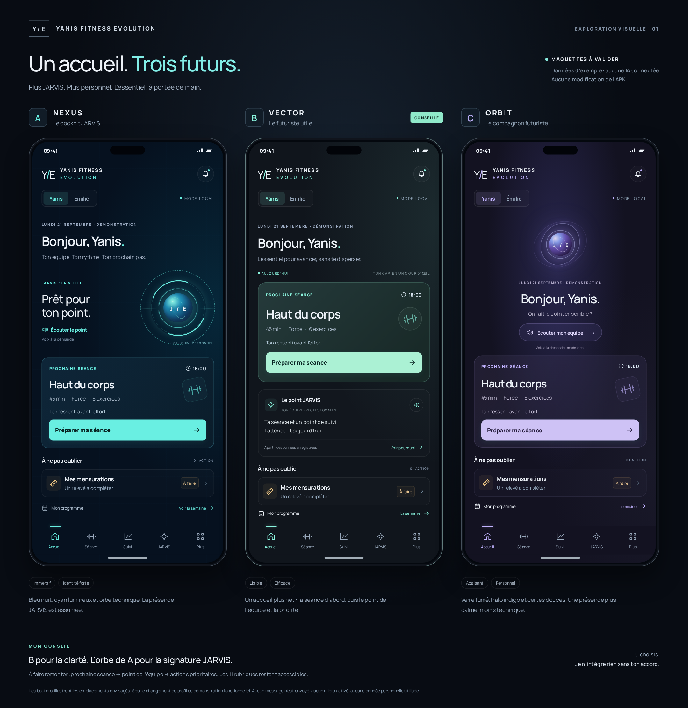

# Accueil JARVIS — orbe bleu animé, clair et sombre coloré

> **Livraison 1.4.0 :** cet accueil est maintenant inclus dans [le nouvel APK signé](../../downloads/INSTALLATION-1.4.0.md), après autorisation d’une installation séparée. Les études ci-dessous restent des références historiques.

**Étude visuelle du 21 septembre 2026. Aucune intégration à l’application.** L’utilisateur demande à voir les idées avant de valider et place cette étape avant l’IA conversationnelle. Lire aussi [`../../PASSATION.md`](../../PASSATION.md).

## Validation reçue et intégration

L’utilisateur a répondu **« Parfait je valide »** à la révision 03. [L’intégration au candidat web complet est réalisée et testée](../../evolution/home/README.md) (4 tests Node, 90 tests navigateur). Aucun nouvel APK produit : signature actuelle à récupérer avant livraison Android. Les sections ci-dessous conservent l’historique des études, pas un nouvel appel à validation.

## Révision actuelle : orbe bleu tournoyant + ancienne carte séance

L’utilisateur a corrigé la maquette claire : **garder le bleu de l’orbe et le faire tourner**, montrer un **mode sombre coloré**, et reprendre le format de **Prochaine séance avec l’homme sur la machine**.

**[Voir la révision 03 et sa documentation](revision-bleu/README.md)** : [clair](revision-bleu/maquette-claire.png), [sombre coloré](revision-bleu/maquette-sombre.png), [comparatif](revision-bleu/comparatif.png), [orbe animé](revision-bleu/orbe-bleu-anime.gif), [prototype](revision-bleu/index.html).

- Photographie exacte retrouvée dans l’APK et présentation d’origine adaptée au téléphone.
- Orbe bleu identique pour les deux profils, anneaux réellement animés ; pause et préférence mouvements réduits dans le HTML.
- Sombre avec cartes violet/vert profond et accents ambre/cyan, pas noir et gris uniforme.
- Deux thèmes × deux profils testés sur sept largeurs ; aucune modification de production. **Validation depuis reçue ; voir l’intégration ci-dessus.**

Montrer les images directement dans le chat, pas uniquement des liens vers le workspace.

## Étude précédente : B × A, couleurs de l’application en mode clair

**Direction choisie par l’utilisateur, pas autorisation d’intégration :**

> « l’organisation de B avec le style lumineux et l’orbe de A.,oui avec les couleurs quil y a sur mon appli en mode claire. Peux tu faire une nouvelle maquette en fonction de ca stp »

- **[Maquette Yanis](clair/maquette-yanis.png)** : ivoire, orange/corail, pêche, lavande et menthe.
- **[Déclinaison Émilie](clair/maquette-emilie.png)** : même hiérarchie, accents rose/violet.
- **[Prototype autonome](clair/index.html)** : changer le profil modifie seulement les exemples et leur palette. Le reste affiche un avertissement de maquette.
- Source isolée dans `clair/` ; aucune ressource, donnée ou fonction de production touchée. Les anciennes propositions A/B/C restent intactes.



### Intention

Garder la séance comme première carte de B, puis le briefing et la priorité. L’orbe lumineux inspiré de A reste **compact**, à droite du bonjour, pour ne pas repousser les actions. Traits techniques discrets et halos chauds plutôt qu’un fond sombre. Navigation visible et programme accessible ; le bouton Plus représente les autres rubriques conservées, pas leur suppression.

### Palette vérifiée

La référence est le **CSS réellement embarqué dans l’APK complet 1.3.0 livré**, pas l’ancien thème des sources React. Il ne s’agit pas d’une capture de l’APK : la composition est une nouvelle proposition.

| Élément | Référence de l’application |
|---|---|
| Fond clair Yanis | `hsl(36 18.6% 96.2%)` |
| Accent Yanis | `hsl(30 88% 44%)` ; secondaire `hsl(12 82% 52%)` |
| Dégradé d’action Yanis | `hsl(36 92% 38%)` → `hsl(10 84% 42%)` |
| Accents Émilie | `hsl(334 74% 50%)` / `hsl(272 66% 58%)` |
| Dégradé d’action Émilie | `hsl(334 84% 44%)` → `hsl(272 76% 50%)` |
| Cartes pastels | Ambre `#fff0ce`, lavande `#ece5f6`, pêche `#fce2d4`, menthe `#dff2ec` |
| Titres | `#251e18` |

Halos, reflets de l’orbe et mélanges de surfaces sont des interprétations de ces couleurs pour la nouvelle maquette. La date, la séance, sa durée, le briefing et la priorité sont **des exemples**, pas des informations sportives réelles.

### Vérification et reproduction

Avec le serveur ci-dessous, ouvrir `/clair/`. Le script dédié vérifie les **deux profils sur sept largeurs**, l’absence de débordement/texte tronqué/recouvrement par la navigation, les palettes et icônes, les actions inertes et l’absence de stockage web, de requête externe ou d’erreur JavaScript. Il exporte les deux PNG ; les images finales ont aussi été inspectées visuellement.

```sh
LD_LIBRARY_PATH=$PWD/.cache/browser-libs/lib \
  node design/accueil-jarvis/clair/render.mjs
```

**Prochaine étape : avis de l’utilisateur sur cette nouvelle maquette, puis ajustements éventuels.** Aucune intégration et aucune IA conversationnelle avant accord. Montrer le PNG directement dans le chat : l’utilisateur a indiqué se perdre dans le workspace.

## Comparatif initial conservé



| Piste | Intention | Compromis |
|---|---|---|
| [A — NEXUS](proposition-a.png) | Cockpit bleu nuit/cyan, anneaux et orbe JARVIS, statut local visible. | Le plus immersif ; limiter la place du décor pour garder les actions proches. |
| [B — VECTOR](proposition-b.png) | Séance tout en haut, puis point de l’équipe et priorité ; graphite/menthe. | Le plus lisible et efficace ; présence JARVIS moins spectaculaire. |
| [C — ORBIT](proposition-c.png) | Halo indigo, verre fumé, orbe doux et accompagnement personnel. | Plus calme, mais le héros prend davantage de place avant la séance. |

**Recommandation initiale, depuis choisie comme direction :** B comme structure, avec un orbe compact inspiré de A. L’utilisateur a ajouté le mode clair avec les couleurs de son application ; la nouvelle maquette ci-dessus attend sa validation. Les noms NEXUS/VECTOR/ORBIT sont des noms de pistes, pas des changements du nom **Yanis Fitness Evolution**.

## Hiérarchie B retenue pour la nouvelle étude

L’organisation B est choisie pour la maquette. Règles à conserver lors d’une éventuelle intégration autorisée :

1. En cas de besoin : alerte de sécurité/stockage ou séance/chrono en cours, toujours avant le décor et jamais masquée.
2. **Prochaine séance réelle** et bouton **Préparer ma séance**. Pas de séance inventée ni de lancement automatique ; s’il n’y a rien de prévu, proposer d’ouvrir le programme.
3. **Point JARVIS de l’équipe**, court, fondé sur les données existantes, avec Pourquoi et lecture à la demande. Aucun micro activé seul.
4. **Une à trois priorités** utiles : bilan, mensurations, décision à examiner. Lire ou ouvrir n’enregistre pas une réalisation.
5. Le reste du suivi et des historiques plus bas. Les **11 rubriques** restent accessibles ; le bouton Plus du dessin représente l’accès à tous les modules, pas leur suppression.

Ce choix de direction n’est pas une validation de l’écran final ni une permission de modifier l’APK. Aucune autre demande précise de rubrique à remonter n’a été formulée.

## Ce qui est réel dans cette étude

- HTML/CSS/SVG autonomes, hors du bundle et des ressources de l’APK.
- Texte, séance, durée et rappel **fictifs, marqués comme données d’exemple**.
- Le choix Yanis/Émilie ne modifie que la maquette concernée. Les autres boutons expliquent qu’il ne s’agit pas encore de fonctions reliées.
- Le cadre de téléphone, l’encoche et l’heure sont des éléments de présentation : ne pas les recopier comme fausse barre système dans l’application. Tous les exemples devront être remplacés par les états réels ou des états vides après validation.
- Aucun accès aux sauvegardes, aucun appel d’IA, aucune activation du micro, aucun appel natif, aucune écriture localStorage/IndexedDB.
- Les premières études sont statiques. La révision 03 anime les anneaux bleus à la demande explicite de l’utilisateur, avec pause et respect d’Animations réduites dans le prototype HTML ; un GIF séparé illustre la rotation.
- La police Manrope est copiée depuis les ressources existantes avec sa licence OFL. Aucun nouvel outil natif ni clé privée utilisé.

## Voir les propositions

Ouvrir `index.html`, ou servir **uniquement ce dossier**, jamais la racine du dépôt :

```sh
python3 -m http.server 5181 --bind 0.0.0.0 --directory design/accueil-jarvis
```

Le comparatif PNG et les trois vues séparées sont conservés dans Git pour rester accessibles depuis une nouvelle conversation, même si l’aperçu temporaire s’arrête.

## Vérifications de la maquette

`render.mjs` vérifie les trois concepts, les largeurs 320/360/390/768/1024/1280/1440 px, l’absence de débordement horizontal ou de contenu recouvert par la navigation, l’isolation des profils de démonstration, l’absence d’écriture des stockages web, d’appel externe et d’erreur JavaScript. Il produit le comparatif et les trois vues séparées.

```sh
# Dépendances de test du dépôt + Chromium local nécessaires.
CHROMIUM_EXECUTABLE_PATH=/chemin/vers/chromium \
  node design/accueil-jarvis/render.mjs
```

Pour cet environnement : Chromium 138.0.2 provenant du package npm `@sparticuz/chromium`, binaire `/tmp/chromium`, bibliothèques sous `.cache/browser-libs/lib` et variable `LD_LIBRARY_PATH`. Ces outils sont temporaires et hors Git.

L’APK 1.3.0 reste strictement inchangé, SHA-256 `4c2efeaea0d1d59e9bc329f4b3651e2a860a1416bad900c23a15e0249622a323`. Les essais ci-dessus concernent **les maquettes uniquement**, pas de nouvelles validations Android.

**Prochaine étape : choix et ajustements visuels par l’utilisateur ; intégration seulement après son accord. L’IA reste en pause.**
