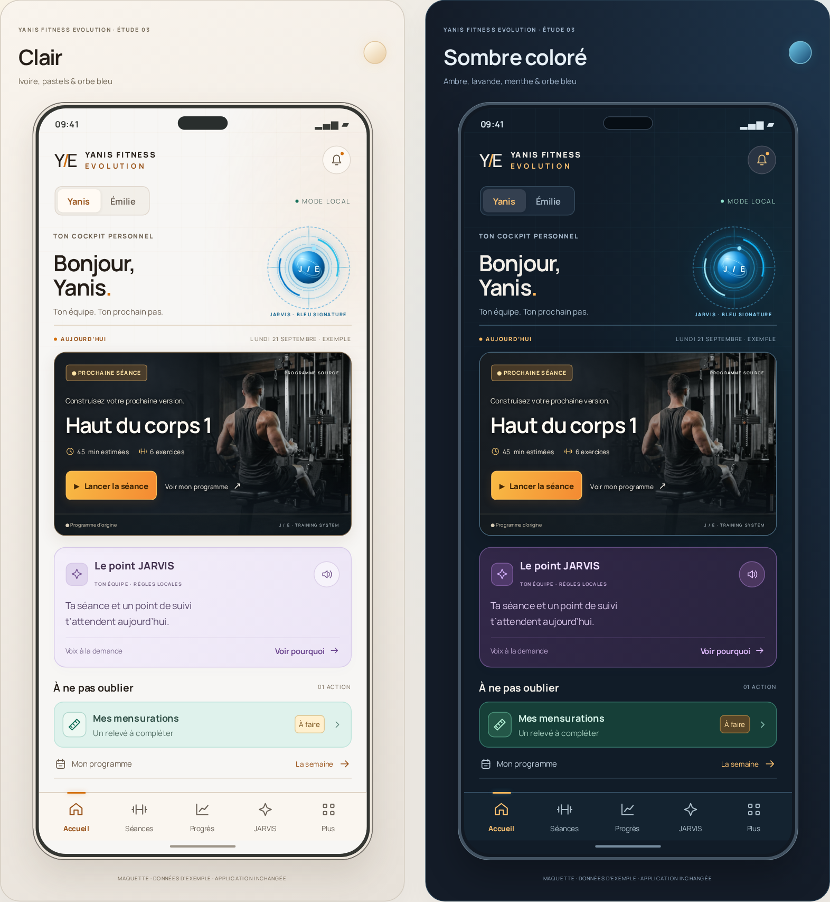
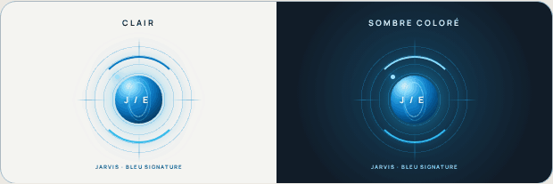

# Révision 03 — orbe bleu animé, clair et sombre coloré

**21 septembre 2026 — maquettes uniquement, intégration non autorisée.**

## Demande exacte

> L'orbe de jarvis faudrait qu'il garde le bleu et tournoyant.
>
> En sombre faudrait quil garde aussi des couleurs. Peux tu me montrer en maquette
>
> "Prochaine séance" je souhaite le format et la présentation d'avant avec le mec sur la machine. C'était top

Cette demande corrige la précédente proposition B × A claire : **l’orbe ne prend plus la couleur du profil**. L’organisation B reste la base. Le choix de direction n’autorise toujours aucune modification de l’APK.

## À montrer directement dans le chat

- [Mode clair](maquette-claire.png).
- [Mode sombre coloré](maquette-sombre.png).
- [Comparatif](comparatif.png).
- [Aperçu animé de l’orbe bleu](orbe-bleu-anime.gif) : boucle de huit secondes, 100 images, environ 2 Mo.
- [Prototype interactif](index.html) : rotation CSS réelle, commande pause/reprise et préférence système de mouvements réduits respectée. Cette préférence concerne le prototype HTML, pas le fichier GIF exporté.





## Changements visuels

- Même **orbe bleu/cyan pour les deux profils et les deux thèmes**, anneaux en rotation, noyau et reflets bleus. Aucune interprétation comme écoute micro, capteur ou IA connectée.
- Clair : fond ivoire, accents orange pour Yanis / rose pour Émilie, briefing lavande et priorité menthe.
- Sombre : fond bleu nuit/ardoise, **cartes réellement colorées** (violet et vert profond), accents ambre/orange ou rose, repères cyan. Pas un écran noir et gris uniforme.
- Retour de la **carte photographique d’origine** : homme sur la machine à droite, texte à gauche, badge « Prochaine séance », titre, durée/exercices, bouton « Lancer la séance », lien programme et pied de carte. Composition adaptée au cadre de téléphone, pas copie à l’identique des dimensions du bureau.
- Les boutons d’application sont volontairement inertes : même « Lancer la séance » affiche seulement un message de maquette. Lors d’une intégration autorisée, conserver les confirmations et le parcours pré-séance existants ; aucun contournement de sécurité pour reproduire le dessin.

## Origine du visuel, pas une nouvelle image générée

`training-hero.jpg` est copié **octet pour octet depuis `assets/public/training-hero.jpg` de l’APK livré 1.3.0**, identique au fichier déjà présent dans `JARVIS-Fitness-Source/public/training-hero.jpg`.

SHA-256 de la photo : `4ff815667c0eaf0a5b08ad1faa6ec06afe26c4b936880a42382cffa01bf3e446`.

La disposition d’origine a été vérifiée dans le bundle embarqué et dans les références existantes, notamment `clair-ensemble.png` et les captures utilisateur du dépôt. Aucune de leurs valeurs de santé ou données sportives n’est reprise : les textes de la maquette sont des exemples marqués comme tels.

Le style commun est chargé depuis `../clair/clair.css`, sans modifier cette étude précédente. Police et icônes proviennent des maquettes existantes. Les surcharges, l’animation et le comportement autonome sont dans ce dossier, hors des ressources de production.

## Vérifications

`render.mjs` contrôle :

- Les thèmes clair/sombre et les deux profils, aux largeurs 320, 360, 390, 520, 768, 1024 et 1440 px.
- Pas de débordement horizontal, de texte tronqué, de recouvrement par la navigation ni de superposition avec le pied de la carte photo.
- Chargement de la photo originale, icônes présentes, aucun fichier en erreur.
- Orbe effectivement tournoyant ; pause/reprise ; arrêt sous `prefers-reduced-motion` ; orbe toujours bleu après changement de profil.
- Profils de démonstration indépendants, actions d’application inertes, stockages web vides, aucune requête externe ni erreur JavaScript.
- Export des trois PNG. Inspection visuelle du comparatif et du GIF effectuée.

Ces contrôles concernent **les maquettes, pas Android**. APK revérifié inchangé : `4c2efeaea0d1d59e9bc329f4b3651e2a860a1416bad900c23a15e0249622a323`.

## Reproduire

Depuis la racine du dépôt, servir uniquement le dossier de design (le serveur redirige sa page d’accueil vers cette révision) :

```sh
python3 design/accueil-jarvis/revision-bleu/serve.py
```

Le serveur écoute sur `0.0.0.0:5182`. Pour les outils, les dépendances Playwright du dépôt et Chromium sont nécessaires. Dans l’environnement préparé :

```sh
LD_LIBRARY_PATH=$PWD/.cache/browser-libs/lib \
  node design/accueil-jarvis/revision-bleu/render.mjs

# Facultatif : régénérer la boucle GIF. Pillow doit être disponible.
LD_LIBRARY_PATH=$PWD/.cache/browser-libs/lib RENDER_GIF=1 \
  node design/accueil-jarvis/revision-bleu/render.mjs
PYTHONPATH=.cache/image-tools \
  python3 design/accueil-jarvis/revision-bleu/make-gif.py
```

`DESIGN_URL` peut remplacer l’origine locale utilisée par les tests. `CHROMIUM_EXECUTABLE_PATH` peut remplacer `/tmp/chromium`. Les captures intermédiaires restent dans `.cache/revision-design/orb-frames/`, hors Git. Ne jamais servir la racine du dépôt ou ses données privées.

**Prochaine étape : demander si les deux maquettes, la carte retrouvée et le mouvement de l’orbe conviennent, puis ajuster si nécessaire. Aucune intégration autorisée ; IA conversationnelle toujours en pause.**
