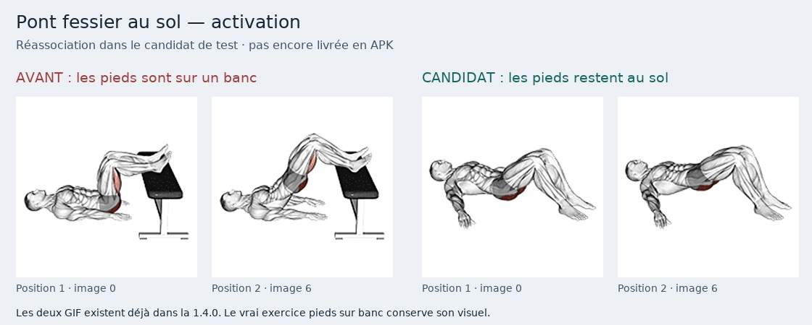

# Revue des animations longues — 23 septembre 2026

> Compte rendu du passage de revue longue. La suite cumulative (French press, vignettes et repos) est dans [REVIEW-SHORT-FOCUS.md](REVIEW-SHORT-FOCUS.md) ; les résultats courants sont dans [validation.json](../candidate/validation.json). Les limites de surfaces mentionnées ici décrivent le passage précédent.

**46 GIF / 588 images internes examinés sur planches intégrales ordonnées.** 43 séquences de 12 images et 3 séquences de 24 images. Ce n’est ni la validation finale de tous les exercices, ni une certification anatomique, ni un test de chaque animation sur toutes les surfaces Android.

Les dessins ont été lus sur 12 planches à vignettes de 150 px, puis quatre séquences (1, 12, 25, 35) agrandies à la résolution source. Les doubles contours visibles proviennent des fondus du fichier. Le passage dernière/première image a été comparé, sans prétendre avoir regardé tous les GIF en lecture réelle. Les variantes incertaines restent ouvertes.

## Associations réellement concernées

**102 associations** : 97 exercices de musculation et 5 guides piscine. **58 écarts**, **23 variantes à préciser**, **21 gestes de base visuellement cohérents**. Aucun de ces trois états ne vaut acceptation finale de l’application.

Un registre dérivé suit les **209 identifiants d’exercice**, y compris ceux encore en attente : `exercise-coverage.json`. Les étirements, échauffements, autres guides et protocoles restent dans l’inventaire complet et les constats, sans être déclarés validés par cette revue de GIF longs.

Dix groupes ajoutés aux 26 déjà ouverts : **36 groupes ouverts**. Leurs identifiants sont dans `findings.json`. Les cas seulement ambigus restent marqués comme tels, pas promus en erreurs certaines.

## Correction limitée, même style conservé

Le seul identifiant `pont-fessier-au-sol-activation` utilise désormais, dans le candidat, le GIF existant `/media/8eecb0152081ff26.gif` (pont au sol sans charge). Le vrai `glute-bridge-pieds-sur-banc` conserve `/media/0766d3a06bf79dc8.gif`. Aucun fichier image n’est changé ; aucune définition d’exercice ni prescription n’est modifiée.

Testé en fiche pour les deux profils : GIF effectivement animé (captures du rendu différentes), pause/reprise, et maintien du GIF de la variante sur banc. **La vignette bibliothèque de cet exercice reste encore la vue anatomique d’origine**, car elle lit `k.gif`, pas `Kh`. Les consignes génériques `Yu.bridge` mentionnent encore « banc ou sol » et une charge : leur précision par exercice reste à examiner sans changer la prescription. Les chronos/approches déjà enregistrés et toutes les autres surfaces ne sont pas validés par ce test de fiche. Le groupe reste donc ouvert.



## Registre des fichiers

| N° | Fichier | Geste réellement observé | Réserve / décision |
|---:|---|---|---|
| 01 | `03098b19c4672ce5.gif` | Adduction de hanche debout à la poulie : jambe tirée depuis le côté vers la ligne médiane, face interne de cuisse colorée. | Ne correspond pas à une abduction ; encore moins à un fire hydrant à quatre pattes. Agrandissement 310 px revu. |
| 02 | `04ab405e919744b5.gif` | Rowing un bras avec haltère, genou et main sur banc. | Source à conserver ; aucune association musculation dans cet inventaire, pas de réaffectation automatique. |
| 03 | `0766d3a06bf79dc8.gif` | Pont fessier bilatéral, pieds posés sur un banc. | Cohérent pour pieds sur banc, pas pour activation au sol sans banc. |
| 04 | `0860394a5a99f74b.gif` | Tirage horizontal assis à la poulie, buste et coudes en mouvement. | Matériel poulie visible, pas un élastique. |
| 05 | `1317e405efd6ef2b.gif` | Planche sur avant-bras qui pivote en planche latérale bras levé. | Pas un maintien de planche statique ; ne couvre pas le bird dog du circuit. |
| 06 | `1519aacc58d53c5c.gif` | Pont fessier bilatéral au sol avec barre sur le bassin, sans banc sous le dos. | Pas unilatéral. Distinction hip thrust sur banc / pont au sol à respecter. |
| 07 | `1c63a36d168d8b74.gif` | Charnière de hanche / soulevé de terre avec deux haltères, deux pieds au sol. | Pas un soulevé de terre sur une jambe. |
| 08 | `1f27c3cbcf803765.gif` | Presse à cuisses inclinée ; flexion puis extension des jambes sur la machine. | 24 images vues. Placement précis pieds hauts à confirmer sur grand affichage ; ne pas certifier cette variante sur une miniature. |
| 09 | `22ce97e4b3cb18cf.gif` | Développé avec deux haltères sur banc incliné. | Mouvement de base cohérent ; détails des prises et variantes à vérifier séparément. |
| 10 | `2c51d8ca1b6fb79a.gif` | Squat debout avec barre sur le haut du dos. | Mouvement de base cohérent ; la charge et le tempo du programme ne se déduisent pas du GIF. |
| 11 | `36c6cb37445d3880.gif` | Curl bilatéral debout avec haltères, sans pupitre ni appui de coude. | Ne couvre ni Scott, ni concentration, ni Zottman assis ; ne valide pas les prises particulières. |
| 12 | `3bcaad5ec7cdf892.gif` | Mains partent de la poitrine puis montent au-dessus de la tête contre un câble latéral. | Variante anti-rotation bras hauts, pas une extension horizontale classique. Consignes détaillées du Pallof à confronter avant validation ; poulie != élastique. Agrandissement revu. |
| 13 | `3e2ed581e11781d5.gif` | Élévations de mollets sur support avec barre sur le dos, deux jambes. | Pas une démonstration unilatérale au poids du corps. |
| 14 | `43bad87368c12614.gif` | Pompes avec mains sur supports surélevés. | Cohérent pour pompes inclinées ; ne certifie pas des pompes classiques mains au sol. |
| 15 | `489169360e044c48.gif` | Extension du coude vers l’arrière à la poulie, buste penché : kickback triceps. | Le catalogue vise le grand fessier et une extension de jambe, pas le coude. |
| 16 | `48fe4a8cbb0d125c.gif` | Relevés des deux jambes allongé sur un banc. | Pas des ciseaux au bord de la piscine. |
| 17 | `497ab2e22c01080c.gif` | Extension des triceps debout à la poulie haute, coudes près du corps. | Mouvement de base cohérent pour pushdown ; pas une validation de toutes les poignées/prises possibles. |
| 18 | `4af33157ce25267c.gif` | Tirage vertical assis à la poulie avec barre large, vue de dos, arrivée près de la nuque. | Pas des tractions suspendues, ni une prise neutre ; trajet devant/derrière à confronter aux consignes. |
| 19 | `6223da1b562d9339.gif` | Soulevé de terre sur une jambe avec barre tenue des deux mains. | Geste unilatéral visible. Matériel barre alors que le champ catalogue indique bodyweight : association précise à revoir, pas de modification arbitraire du programme. |
| 20 | `66849c3144d589f2.gif` | Enroulement du bassin allongé, résistance d’un câble attaché aux pieds. | Reverse crunch chargé à la poulie ; vérifier la variante sans matériel attendue. |
| 21 | `6809d9052927484a.gif` | Montée sur banc/step avec deux haltères tenus le long du corps. | Vrai step-up déjà embarqué, mais pas automatiquement équivalent aux deux exercices classés bodyweight. Reste une candidate, non intégrée. |
| 22 | `7517a916496ec766.gif` | Montées alternées des genoux avec les mains en appui contre un mur à sec. | Ni talons ramenés aux fesses, ni démonstration aquatique. |
| 23 | `78f9aee57a4101b1.gif` | Squat avec un haltère tenu devant la poitrine (goblet). | Cohérent pour goblet ; présence de charge à distinguer d’un squat au poids du corps. |
| 24 | `7c0c6d264e85d66a.gif` | Flexion des genoux couché sur le ventre à la machine, rouleau aux chevilles. | Leg curl allongé machine, pas swiss-ball ni variante assise. |
| 25 | `8eecb0152081ff26.gif` | Pont fessier au sol sans charge, deux pieds au sol, bassin monte puis descend. | 12 images et raccord dernière/première examinés, puis agrandissement 310 px. Candidate cohérente pour pont-fessier-au-sol-activation, sans banc ni changement de style. |
| 26 | `93ab17b0de26fbc8.gif` | Rowing buste penché avec barre, tirage vers l’abdomen. | Mouvement de base cohérent ; charge maximale et tempo ne sont pas vérifiables sur cette seule démonstration. |
| 27 | `995e1f9a9cedc5ec.gif` | Fente avec deux haltères, retour debout, un côté montré par boucle. | Pas de montée sur banc, pas de barre ; ne montre pas une marche en fentes ni l’alternance complète. |
| 28 | `a4c1fb89be18062f.gif` | Développé avec deux haltères sur banc plat. | Pas le banc incliné d’une des associations. |
| 29 | `aab0de0aad0c275a.gif` | Planche latérale avec élévation de la jambe supérieure. | Ni bird dog à quatre pattes, ni mobilité des épaules. |
| 30 | `afe2f533cbbef546.gif` | Relevé des jambes allongé avec partenaire debout à la tête, mains sur ses chevilles et contact aux pieds. | Partenaire présent, contrairement à une démonstration autonome : variante à revoir sans effacer cet élément. |
| 31 | `b2236e6b7a81a1b5.gif` | Allongé sur le dos, bras levés, alternance d’extension des jambes. | Variante de dead bug surtout jambes ; pas de rotation du tronc visible et pas une simple respiration. |
| 32 | `b2b32833d73d3ca4.gif` | Mobilité des épaules debout avec une bande tenue des deux mains, passage au-dessus de la tête. | À sec avec bande, pas mobilité aquatique. |
| 33 | `b49969e64dc275f5.gif` | Abduction des genoux assis sur banc avec une bande autour des cuisses. | Source intéressante pour la variante assise avec bande ; pas clamshell couché sur le côté. Non intégrée. |
| 34 | `bc4d9bed4bbb590a.gif` | Fente arrière avec barre sur le dos, retour debout, un côté montré. | Pas de saut ; pas une variante explicitement au poids du corps. Autres libellés génériques à confronter à la prescription. |
| 35 | `c07b14f1bcc8e8ca.gif` | Planche mains au sol avec montées alternées des genoux, retour jambes allongées. | 24 images et agrandissement revus. Mouvement de base compatible avec mountain climbers ; ne pas le remplacer sur une impression issue de petites vignettes. |
| 36 | `c1065beff4823907.gif` | Crunch assis sur banc avec câble derrière la tête. | Ne représente pas le circuit crunch + relevés + gainage, ni son matériel bodyweight. |
| 37 | `ca785b4cf81c98fa.gif` | Tirage vertical assis à la poulie, barre large vers la nuque. | Pas un face pull debout, ni un mouvement avec bande. |
| 38 | `cd0cc940608ac100.gif` | Élévations latérales debout avec deux haltères. | Mouvement de base cohérent. Les mini-séries myo-reps relèvent du programme, pas de l’identité du geste. |
| 39 | `cf312b839f6da027.gif` | Fente bulgare avec deux haltères, pied arrière sur banc, pied avant au sol. | Pas hip thrust ; pas pied avant surélevé ; pas barre ni poulie. Garder la source pour les bonnes variantes. |
| 40 | `d06257e45606b033.gif` | Planche latérale avec élévation de jambe, autre vue. | Aucune association musculation dans cet inventaire ; pas de réaffectation automatique. |
| 41 | `d9c88be0658a81af.gif` | Développé épaules assis avec deux haltères. | Pas développé un bras debout. Prises neutre/pronation et rotation à revoir en détail. |
| 42 | `e56d7d8feec13a3a.gif` | Planche latérale dynamique avec pieds sur un banc, appui sur avant-bras au sol. | Variante pieds surélevés, pas nécessairement le gainage au sol demandé. Ne pas confondre avec vertical en piscine. |
| 43 | `e5f17140d8d97591.gif` | Pont maintenu haut avec levées alternées des jambes (marche en pont). | 24 images : pas de redescente bilatérale à mi-course puis remontée correspondant aux répétitions 1,5. |
| 44 | `f1dde35bd517f24b.gif` | Gainage latéral incliné en appui du bras sur un banc. | Pas le gainage vertical debout au bord du bassin. |
| 45 | `f73444e9dc2fee89.gif` | Ouverture/fermeture des cuisses assis sur machine d’abduction. | Pas élastique ni clamshell ; pas de répétition 1,5 visible. Conserver pour abduction assise machine. |
| 46 | `faa82528766b9402.gif` | Flexion du genou allongé sur le ventre, câble attaché à une cheville. | Leg curl à la poulie au sol, pas mobilité hanches/chevilles aquatique. |

## Reproduire sans réinventer la revue

```bash
python3 -m pip install --target .cache/image-tools pillow==12.3.0
PYTHONPATH=.cache/image-tools python3 evolution/media/review_frames.py
node evolution/media/coverage.mjs
node --test evolution/media/tests/*.test.mjs
```

`review_frames.py` produit seulement les planches et hachages sous `.cache/`. Il ne crée jamais de décisions de conformité. Le registre `long-animations.json` contient les observations, tous les indices lus, les hachages RGBA et les états par association. Ne pas effacer les réserves lors d’une reprise.
