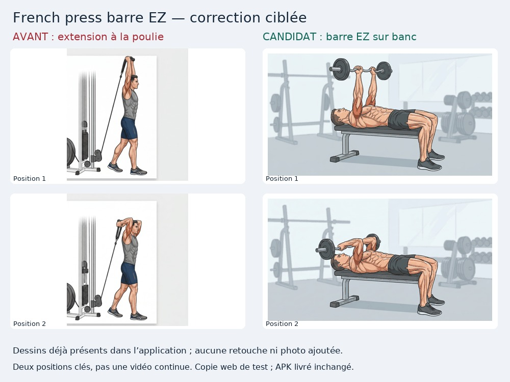

# Revue ciblée — triceps, dessins courts et vignettes

> Passage précédent. La suite consignes/échauffement et les résultats courants sont dans [REVIEW-WARMUP.md](REVIEW-WARMUP.md) et [validation.json](../candidate/validation.json).

23 septembre 2026. **Candidat web seulement ; APK publié inchangé.**

## Travail réellement effectué

- Relecture des **13 GIF à deux images** sélectionnés, soit 26 images sur cinq planches à 300 px. Sous-ensemble des 48 GIF courts, pas 13 nouveaux médias et pas une validation globale.
- Les 46 GIF longs / 588 images du passage précédent restent dans `long-animations.json` ; pas de répétition de cette revue.
- Deux vignettes WebP originales affichées à leur taille réelle et examinées ; elles correspondent au pont au sol et au French press retenus.
- Registre SHA, indices, durées, observations et associations existantes : [short-focus.json](short-focus.json). Un fichier sans résolution musculation n’est pas forcément inutilisé : des guides piscine l’emploient.

## Observations des deux positions

| GIF | Mouvement observé | Décision / limite |
|---|---|---|
| `10ab787fbf26b1f4.gif` | Un pied sur marche, autre jambe vers le sol ; deux poses très proches, aucune élévation claire du talon de la jambe porteuse. | Ne démontre pas clairement les mollets unilatéraux prescrits ; pas de nouvelle association. |
| `2e234599c9335530.gif` | Pompes inclinées, mains au bord, jambes immergées et corps aligné dans l’eau. | Geste de base compatible avec Pompes au bord ; technique, boucle et surfaces à confirmer. Pas un dip sur barres. |
| `37f614cd3432709b.gif` | Un pied sur une caisse et l’autre au sol ; poses très proches, pas de montée complète. | Ne pas substituer au step-up : amplitude complète non montrée. |
| `4c2b19fa924f90a8.gif` | Extension du coude au-dessus de la tête, debout en fente, corde reliée à la poulie basse. | Compatible de base avec French press poulie basse, pas avec barre EZ ni haltères sur banc. Ne pas remplacer la variante poulie. |
| `5d6a89132df205f8.gif` | Extension triceps debout avec barre coudée au-dessus de la tête, flexion derrière la tête. | Ne montre ni pullover combiné, ni barre au front couché, ni California press. Les noms génériques restent ambigus ; pas de remplacement de famille. |
| `a8fb4616e53e9cb9.gif` | Traction en position haute dans les deux poses, jambes croisées puis repliées. | Pas de phase basse bras tendus : pas un remplacement validé pour les tractions. |
| `b0d0b89c32ca0aec.gif` | Traction en position haute, pieds et coloration musculaire changent ; coudes restent fléchis. | Pas de cycle de traction complet : ne pas réutiliser sur un simple rapprochement du nom. |
| `c3a2b9892161522e.gif` | Dips sur barres, tête vers la droite puis la gauche sans changement cohérent des appuis et des jambes. | Défaut d’orientation confirmé dans les deux images et au retour de boucle ; aucune correction par miroir/rotation. |
| `e035a3d8e8c21744.gif` | Montées de genoux alternées, bras en opposition, buste vertical dans l’eau. | Geste aquatique de base identifiable ; ne pas réutiliser comme exercice terrestre. Pas d’acceptation de toutes ses associations. |
| `ea226c444f72de0f.gif` | Extension triceps couché sur banc plat avec barre EZ : bras élevés puis flexion du coude, barre vers le front. | Deux positions, orientation et appuis cohérents à l’examen des images et de leur succession cyclique ; pas une animation continue. Correspond au French press barre EZ et à son conseil embarqué « Coudes fixes, barre vers le front ». Réassociation de cet identifiant seulement ; autres variantes non déduites. |
| `ebc7379850a4ee2f.gif` | Traction en position haute dans les deux poses, changement minime des jambes. | Pas de départ bras tendus ni amplitude complète : pas de remplacement validé. |
| `fd7c5fb1226873f6.gif` | Appui des avant-bras sur le bord, buste oblique dans l’eau ; une jambe monte, l’autre reste basse. | Image aquatique, mais alternance complète des battements et consigne exacte à vérifier ; pas un kickback terrestre. |
| `fe34482aa6faf932.gif` | Montées de genoux alternées dans l’eau, buste face caméra, mains près de la surface. | Pas de talon ramené vers la fesse ; ne convient pas à des talons-fesses aquatiques. |

## Réassociation justifiée, sans changer de prescription

**French press barre EZ** : le bundle original contient déjà ce guide exact :

```json
"french press barre ez":{"img":"/media/ea226c444f72de0f.gif","tip":"💡 Coudes fixes, barre vers le front."}
```

Son résolveur effectif sélectionne pourtant `/media/4c2b19fa924f90a8.gif`, qui montre une corde et une poulie. Le candidat choisit le dessin couché avec barre EZ `/media/ea226c444f72de0f.gif` pour **cet identifiant seulement**, après lecture de ses deux positions. Les autres variantes, même proches, ne sont pas devinées.



Aucun nouveau dessin, photo, miroir ou rotation. Le GIF reste une alternance de deux positions de 650 ms chacune, pas une vidéo continue ni une certification médicale de technique.

## Cohérence des surfaces du candidat

- Pour **les deux seuls identifiants corrigés** (French press et pont au sol), fiche et séance conservent le résolveur exact ; la bibliothèque reçoit désormais la bonne vignette via une copie de présentation immuable.
- L’aperçu « Ensuite » du repos et son zoom utilisent la même association ; la séance sauvegardée et le chrono de repos ne sont pas réécrits. Rechargement testé pour chaque identifiant et chaque profil.
- Ce contrôle ne corrige pas les `step.img` des autres chronos guidés, les images d’échauffement/approches, ni les consignes génériques du pont. Les dips restent fautifs ; aucune proposition externe intégrée.
- Aucun groupe fermé : **36 ouverts** ; les 209 exercices sont toujours suivis et aucun n’est promu automatiquement en acceptation finale.

## Tests et preuve de conservation

**26 Node + 14 navigateur ciblés + 8 accueil/11 rubriques réussis** sur le bundle `148cef273a0e3223cc0c3bdb9bdba320163cf1da7582194fcc746155c46b52e8`.

271/272 fichiers web inchangés, dont tous les GIF/vignettes ; seules cinq fonctions d’affichage/résolution et leurs helpers sont autorisées à changer par comparaison AST. 207 résolutions d’exercice sur 209 identiques. Détail des fixtures corrigées et de l’unique libellé bibliothèque autorisé dans les tests accueil : [validation.json](../candidate/validation.json). Aucun APK signé, aucune reprise de la suite complète de 90 tests, aucun test Android physique.

Capture réelle Émilie sombre du French press affichée dans le chat et examinée : barre EZ, banc, tête et appuis visibles. Comparatif ci-dessus affiché également. Ce n’est pas une preuve de toutes les surfaces.

## Reproduire les planches

```bash
PYTHONPATH=.cache/image-tools python3 evolution/media/review_frames.py --short-focus --tile 300
```

Sortie `.cache/media-audit/indexed-short-focus/`, distincte des planches longues. Le script peut aussi produire un seul fichier avec `--short-focus --only /media/ea226c444f72de0f.gif`. Produire une planche ne constitue pas à lui seul sa revue humaine.
