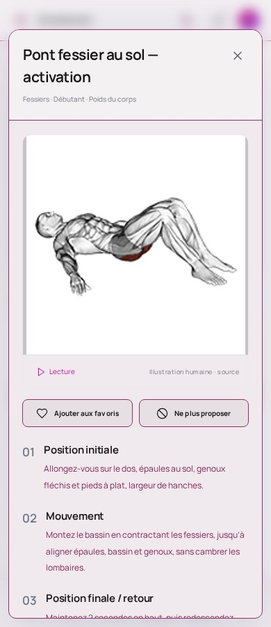
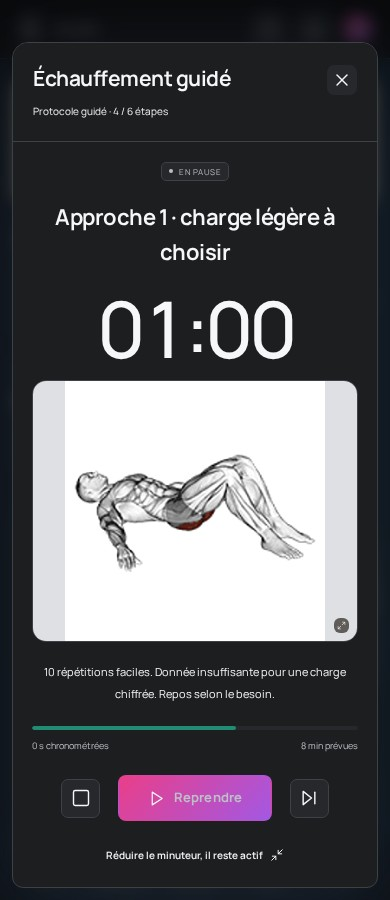

# Revue — pont au sol et échauffement ciblé

23 septembre 2026. **Candidat web seulement**, SHA `5c041fb8d73a40bf0df0bbec64619ba5b54cc2682b85a0cb123ddcb43f8234c6`. APK 1.4.0 intact, pas de signature créée ni de livraison média corrigée.

## Justification : prescription d’abord, dessin ensuite

La note d’origine du seul `pont-fessier-au-sol-activation` impose : « Activation obligatoire : 2 s de contraction en haut, bassin neutre, ne cambrez pas les lombaires. Vous devez sentir le fessier, pas les ischios. » Le catalogue prévoit 2 × 15, tempo 2012 et repos 45 s : aucune de ces valeurs n’a changé.

La fiche héritait pourtant de `Yu.bridge`, qui parle aussi de banc et de charge sur les hanches. Le candidat fournit trois textes propres à cet ID via `JarvisTechnique`, sans modifier `Yu`, la définition de l’exercice, sa note ou les autres variantes. Même sélection en fiche et dans le texte technique **par défaut** de séance ; une note ou un conseil source explicite garde sa priorité. Respiration et erreurs fréquentes restent identiques.

La capture montre le début de la fiche ; le troisième texte, plus bas, est vérifié dans le DOM des tests. Ce n’est pas une validation clinique.

## Échauffement : six étapes, huit minutes inchangées

| Étape | État dans ce passage |
|---|---|
| Mise en route, 180 s | Inchangée, pas validée globalement par cette correction. |
| Mobilité, 60 s | Inchangée ; mobilité bas du corps et image générique encore à traiter. |
| Activation, 60 s | Pour le bas du corps, « Ponts fessiers au sol, 10 répétitions contrôlées » reçoit le GIF au sol déjà revu. Activation scapulaire inchangée. |
| Approches 1–3, 60 s chacune | Image corrigée uniquement si le premier exercice est l’un des deux IDs revus : pont au sol ou French press EZ. Les répétitions 10/6/3, ratios 50/70/85 %, arrondis et charges restent inchangés. |

Les **10 répétitions d’activation** sont la consigne d’échauffement d’origine, pas les 15 répétitions du programme principal. Aucune harmonisation artificielle des deux prescriptions.

Chaque nouvelle approche porte `exerciseId` et `mediaRole: approach`. Les deux boutons de lancement transmettent ces champs. Le chrono peut alors résoudre le visuel propre à cette étape, même si l’ancienne image stockée est générique. Le correctif ne se base jamais sur le premier exercice de la séance actuellement ouverte pour deviner une ancienne approche.

**Limite visible conservée** : le générateur dit encore « charge légère à choisir » pour un mouvement au poids du corps. Cette précision reste à traiter ; le texte n’a pas été réécrit pour justifier l’image.

## Anciennes données : lecture seule

`createWarmupMedia.view` ne modifie pas les étapes enregistrées. L’ancienne activation est reconnue seulement avec le type et nom d’échauffement attendus, le nom complet de l’étape, `pattern: bridge`, 60 s et la consigne exacte de 10 répétitions. Un identifiant explicite contradictoire ou un segment piscine/cardio est rejeté.

Une ancienne approche sans ID/rôle n’est **pas** attribuée à un mouvement par ressemblance, muscle ou nom d’image. Ces approches et les 207 autres exercices conservent encore leur chemin antérieur : elles restent à corriger, pas déclarées couvertes. L’image générale de la fiche d’échauffement et les autres activations/mobilités restent aussi ouvertes.

## Contrôles réellement exécutés

- **32 tests Node PASS** : 9 caractérisations, 17 candidat, 6 traçabilité. Comparaison des 209 exercices × 3 charges × 2 incréments = **1 254 cas** ; textes/temps/arrondis conservés, entrées gelées. Comparaison des 209 techniques : un seul ID diffère et seuls ses trois textes de phases changent.
- **20 tests navigateur ciblés PASS (3,2 min)** : cumul piscine/bibliothèque/fiches/séances/repos, plus six cas échauffement (quatre nouveaux guides, deux anciennes activations). Deux profils, thèmes clair/sombre, zoom, recharge, pause/reprise et achèvement sans perte des données. Les deux boutons de démarrage sont exercés.
- **8 tests accueil/11 rubriques PASS (57,6 s)** sur le même bundle, après la suite médias. Option de comparaison `MEDIA_REVIEW_CANDIDATE=1` inchangée : seulement le libellé de la vignette du pont déjà traité au passage précédent.
- **271/272 fichiers web identiques** ; tous les GIF et vignettes binaires inchangés. AST limité à neuf fonctions et helpers. Contrôle exact des expressions modifiées de fiche/séance/lancement. APK livré vérifié par SHA.
- Aucun test Android physique ni reprise des 90 tests complets. Les 36 groupes restent ouverts ; aucun exercice accepté automatiquement comme terminé.

Les essais initiaux ont révélé des problèmes du harnais (dépendance VM source, nom accessible de la vignette et course de collecte des dossiers temporaires). Ils ont été corrigés sans contournement applicatif. **Exécuter les suites médias puis accueil séquentiellement.** Voir `../candidate/README.md` pour les commandes et `../candidate/validation.json` pour le rapport courant.

## Suite

Dessins manquants pour dips/triceps/fessiers, mobilités et autres approches ; traitement explicite des anciens chronos sans identité. Ne pas convertir globalement en photos, ne pas changer les prescriptions pour adapter les images. Passation à actualiser et présenter à chaque étape, IA conversationnelle en dernier.
